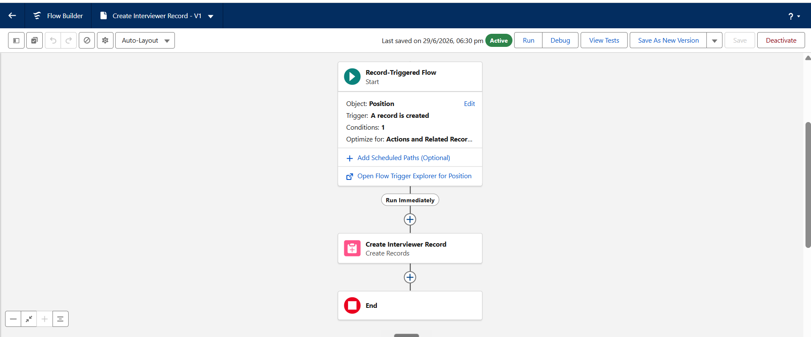
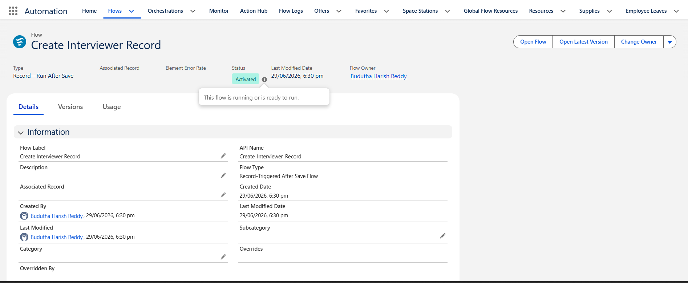
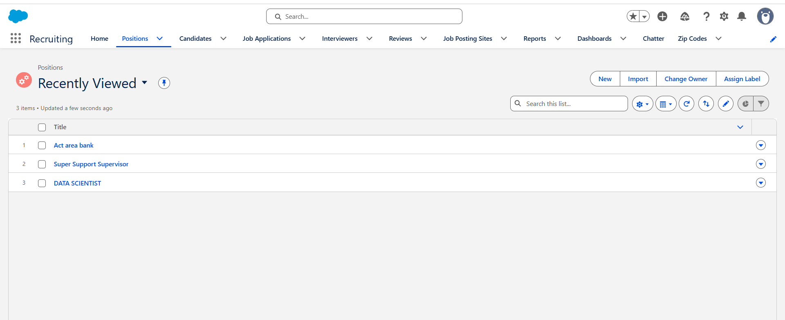
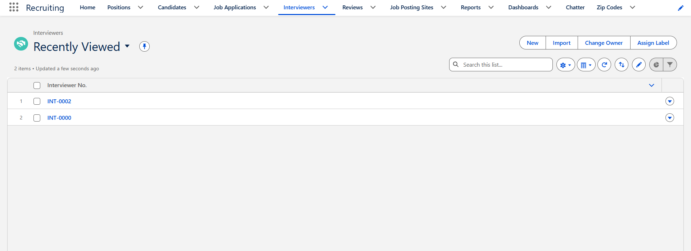
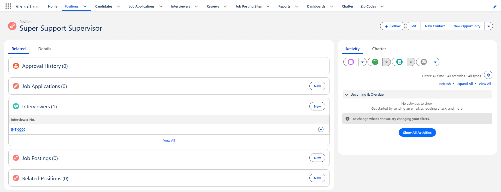

# Salesforce Record-Triggered Flow — Auto-Create Interviewer on Position

A **Record-Triggered Flow** built in Salesforce that automatically creates a linked **Interviewer record** every time a new **Position** is created with a Hiring Manager assigned — eliminating manual data entry and ensuring data integrity across the recruiting pipeline.

---

## Overview

In a recruiting system, every open Position needs at least one Interviewer tied to it. Manually creating that record after each new Position is tedious and error-prone. This flow automates that handoff entirely inside Salesforce using a native Record-Triggered (After Save) Flow — no Apex, no custom code.

---

## How It Works

| Step | What Happens |
|------|-------------|
| **Trigger** | A new `Position` record is created |
| **Condition** | `Hiring_Manager__c` field is **not null** |
| **Action** | Creates an `Interviewer__c` record, mapping `Hiring_Manager__c → Employee__c` and `Position.Id → Position__c` |
| **Result** | The new Interviewer is auto-linked to the Position via a lookup relationship |

The flow runs **after save** so the Position record ID is available for the child record creation.

---

## Flow Architecture

### Flow Builder Canvas



The flow consists of three nodes:
- **Start** — Record-Triggered on `Position`, fires on `A record is created`, optimized for *Actions and Related Records*
- **Create Interviewer Record** — Creates Records action that sets `Employee__c` and `Position__c` fields
- **End**

### Flow Details & Status



| Property | Value |
|----------|-------|
| Flow Label | Create Interviewer Record |
| API Name | `Create_Interviewer_Record` |
| Flow Type | Record-Triggered After Save Flow |
| Status | **Activated** |
| Owner | Budutha Harish Reddy |
| Created | 29/06/2026, 6:30 pm |

---

## Live Demo — End-to-End Execution

### Step 1 — Positions in the System



Three Position records exist: *Act area bank*, *Super Support Supervisor*, and *DATA SCIENTIST*.

### Step 2 — Position Record with Auto-Linked Interviewer



Navigating to the **Super Support Supervisor** Position's **Related** tab shows `Interviewers (1)` — the flow created and linked record `INT-0000` automatically upon Position creation.

### Step 3 — Interviewers Object List



The Interviewers list view confirms two auto-generated records: `INT-0002` and `INT-0000`, each corresponding to a Position that was created with a Hiring Manager assigned.

---

## Key Design Decisions

**Why After Save (not Before Save)?**  
The child `Interviewer__c` record needs the parent `Position__c` record's ID as a lookup value. That ID only exists after the Position is committed to the database, so the flow must run *after* save.

**Why a condition on `Hiring_Manager__c`?**  
Not all Positions may have a Hiring Manager at creation time. The null check ensures the flow only fires when there's a valid person to map to the `Employee__c` field, preventing incomplete records.

**Why Flow over Apex?**  
For declarative, point-and-click automation with no code maintenance overhead. Flows are version-controlled natively in Salesforce, visible to admins, and deployable via Change Sets or the Metadata API.

---

## Objects & Fields Involved

```
Position__c
├── Id                    (used as lookup value in child)
├── Hiring_Manager__c     (Lookup → User / Employee)
└── ... other fields

Interviewer__c
├── Interviewer_No__c     (Auto-number: INT-{0000})
├── Employee__c           (Lookup ← Position.Hiring_Manager__c)
└── Position__c           (Lookup ← Position.Id)
```

---

## Setup & Deployment

1. Ensure both `Position__c` and `Interviewer__c` custom objects exist with the fields above
2. In **Setup → Flows**, create a new **Record-Triggered Flow**
3. Set Object = `Position`, Trigger = *A record is created*, Optimize for = *Actions and Related Records*
4. Add condition: `{!$Record.Hiring_Manager__c} Is Null — False`
5. Add a **Create Records** element, map fields as described above
6. **Save** and **Activate**

---

## Tech Stack


- **Platform:** Salesforce (Recruiting App)
- **Automation Tool:** Flow Builder — Record-Triggered After Save Flow
- **Objects:** `Position__c`, `Interviewer__c`
- **Approach:** 100% declarative — no Apex, no code

---

## Author

**Budutha Harish Reddy**  
[GitHub](https://github.com/Buduthaharishreddy)
